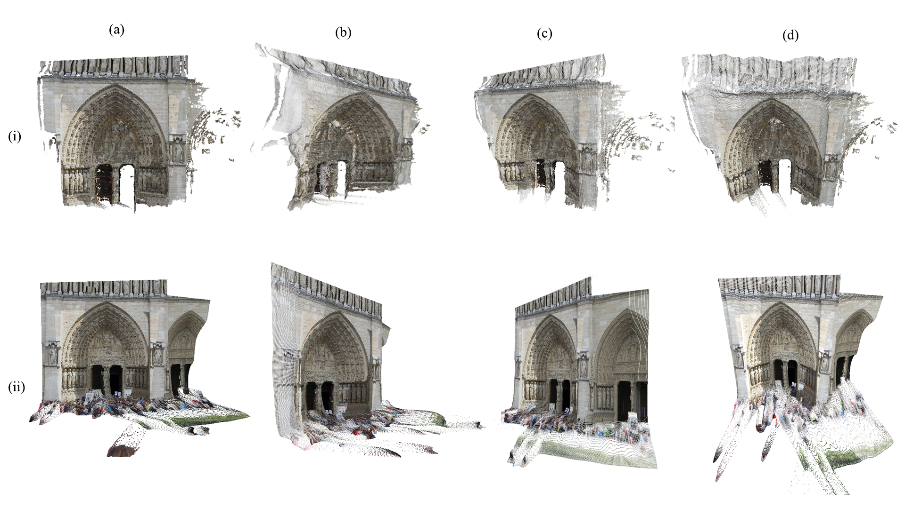

# Evaluating MVS in a CPC Scenario

This repository contains the set of artficats used for the ENGN8601/8602 research project. The thesis emphasizes on the following aspects:

  - Evaluating and Analysing the performance of existing learning-based MVS networks on internet images or in a CPC scenario.
  - Proposing a novel mask estimation module and depth estimation (with depth alignment) framework to estimate depth values of foreground objects.
  - Fusing the depthmaps estimated by the proposed methodology to compute complete point clouds (including foreground objects)

# Installation

Recommended: python 3.7.7 and conda.

The python libraries required are provided in the requirements.txt file. You can install the environment and necessary modules as follows or use your own approach:

Create a new conda environment and activate it:

```sh
conda create -n mvs
conda activate mvs
```
Install requirements.txt:
```sh
conda install --file requirements.txt
```

# Data

Download the validation dataset extracted from MegaDepth dataset [here](https://drive.google.com/file/d/1WvmEYiduKSCVFcFzFqLuF1IQdgVmJZE9/view?usp=sharing) and extract the dataset to **ref_images** folder.

# Usage

All the results have been included in the downloaded dataset already for ease of access to the results. The directory structure is given and explained as follows. The image subdirectories include reference images, npy files containing camera information, entropies, depthmaps (monocular, estimated and ground truth) etc. 

final\_fused\_scenes/
ref_images/
|_ image_2/
|____ grid_outputs   
|____ ply
|____ ply_gt


- All the images inside the  **ref_images** directory contain a **grid_outputs** subdirectory which contain the best masks estimated for the reference image. This subdirectory also contains the plots with the .npy files for visualization.
- All the images inside the  **ref_images** directory contain **ply** and **ply_gt** subdirectories, which contain the 3D world points and .ply files depicting the estimated point cloud of that scene reconstructed by the proposed method.  
- The **final_fused_scenes** folder contains the point cloud generated by fusing multiple depthmaps obtained from different views of the same scene. 

NOTE: You do not need to run the following steps in a sequence since required intermediate results are already provided in the images (such as entropy maps etc.), you can run any step directly. 

### 1. Mask Estimation

Open the terminal and run the following command:

```sh
python masking.py
```

The 10 best masks with lowest binary cross entropy loss and IoU for each reference image is computed and saved inside a **grid_outputs** subdirectory inside each image directory. You can view the mask visualizations which are saved as .png. The masks are also saved as .npy files. 

### 2. Calculating Error Metrics
To calculate the EPE, 1px and 3px errors between the estimated depthmaps and ground truth depthmaps, run the following command:
```sh
python calc_errors.py
```

### 3. 3D Reconstruction - Individual Point Clouds

To reconstruct ground truth point clouds and the estimated point clouds with foreground objects for each individual reference image, run the following command:

```sh
python pfm2ply_aligned.py                   # Point Clouds from Estimated Depthmaps (with foreground)
python pfm2ply_aligned_gt.py                # Point Clouds from Ground Truth Depthmaps
```

The point clouds will be saved in the **ply** and **ply_gt** image subdirectories respectively as .ply files along with the vertices of these point clouds saved as vertices.npy. This also generates the aligned absolute depthmap and saves the visualization along with the monocular depthmap estimated via the monocular depth estimation network. 

### 4. Generating Scene Point Clouds

Since step 3 comptues individual point clouds, the next task is to merge the vertices of each individual point cloud to generate the point cloud for an entire scene. Run the following command:

```python
python merge2ply.py
```

You can specify the set of images to be used for reconstructing each scene by editing the **merge2ply** file. All the scene point clouds are saved in **final_fused_scenes** folder.

# Visualizations of Outputs
### 1. Mask Estimation 

### 2. 3D Reconstruction of Invidiual Depthmaps

### 3. Merged Point Clouds



# Supporting Repositories

I would like to give credit to the following repositories for assisting me in computing intermediate results necessary for the thesis:

  - https://github.com/fdarmon/wild_deep_mvs - Training Vis-MVSNet and generating depthmaps, probability maps and entropy maps for Vis-MVSNet.
  - https://github.com/isl-org/DPT - Computing relative reference depthmaps with the trained state-of-the-art DPT monocular depth estimation network.
  -  https://github.com/wkentaro/labelme - Generating masks and formulation of the validation dataset, used to fine-tune mask estimation parameters and point-cloud analysis.


Thank you!

